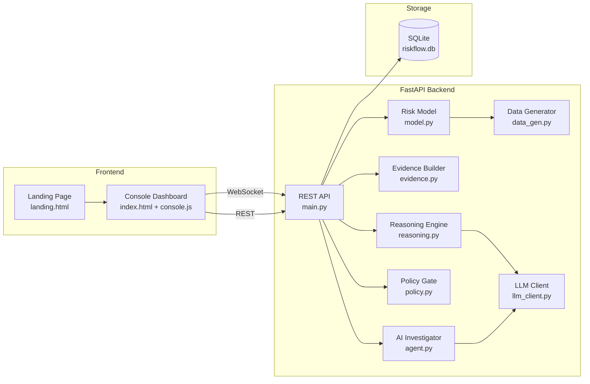
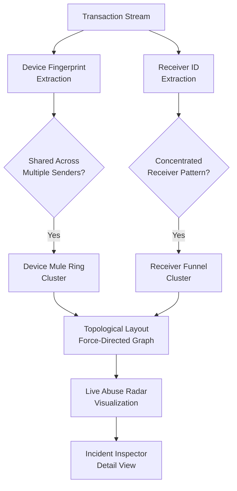

# RISKYN AI 🛰️

### AI Risk Manager for P2P Payments · Razorpay Buildathon Track 02

> A working fraud-spike / abuse-ring detector for P2P payments, built strictly
> defense-only: it scores, explains, and documents — it never authorizes,
> reverses, or moves a single rupee. Honest precision/recall/FPR are reported
> on a **held-out test set the model never touched during training or
> threshold selection.**

---

## Why This Fits the Brief

| Brief Requirement | What's in This Repo |
|---|---|
| *"Build a working detector for one class of loss"* | Isolation Forest + rule-fusion detector for **P2P transaction fraud** — velocity spikes, amount deviation, device-sharing mule rings, receiver-concentration funnels, geo mismatch |
| *"Measured precision and recall on a held-out test set"* | Explicit **60/20/20 train/val/test split**; threshold tuned only on validation; final metrics computed only on the untouched test split (`/api/metrics`) |
| *"Honest metrics including false-positive cost"* | Auditable cost model (₹45/review, ₹3,200/missed fraud) with savings vs. no-detection and flag-everything baselines — see Model Metrics tab |
| *"Strictly defense-only"* | The engine only **scores and recommends** (`ALLOW` / `STEP_UP_VERIFY` / `BLOCK_AND_REVIEW`). The chargeback module only **assembles documentation** for a human to submit — no automated dispute filing, no fund movement |

---

## Architecture



### Abuse Radar — Network Intelligence Pipeline



---

## Features

| Feature | Description |
|---|---|
| **Live Transaction Feed** | Simulated P2P payment stream scored in real-time over WebSocket with visible risk score, decision, and top contributing signal |
| **Explainable Fusion Model** | Five interpretable rule signals (velocity, amount deviation, device ring, receiver mule, geo mismatch) fused with Isolation Forest anomaly score into 0–100 risk score |
| **Amount Guardrails** | Fixed thresholds that force `STEP_UP_VERIFY` or `BLOCK_AND_REVIEW` regardless of ML model score — AI can escalate, never bypass |
| **Reasoning Trace** | Plain-English explanation for every decision. Template-based by default; upgrades to Claude/Gemini/Groq API call if configured |
| **Policy Gate** | Decision bands, amount guardrails, and hard limits read live from the running model — page can never drift from what code enforces |
| **Abuse Radar** | Live network view of devices and receivers shared across senders — the fingerprint of mule rings with <3ms topological layout |
| **Model Metrics + Cost Simulator** | Precision, recall, F1, FPR, confusion matrix on held-out data, plus interactive sliders to recompute cost savings |
| **PR Curve** | Full precision-recall curve with AUC, rendered at multiple thresholds on the held-out test set |
| **Chargeback Evidence Responder** | Converts flagged transaction signals into structured evidence packet for human dispute submission — read-only, defense-only |
| **AI Investigator** | Multi-LLM grounded chat agent that answers questions using only verified database evidence |
| **Metric Integrity Audit** | Automated 4-point audit verifying split ratios, threshold discipline, test isolation, and metric consistency |
| **Audit Log** | Every training run, model load, flag, and evidence generation timestamped for traceability |
| **Light/Dark Theme** | System-aware toggle with persistent preference |

---

## Project Structure

```
riskflow/
├── backend/
│   ├── main.py            # FastAPI app: REST + WebSocket, SQLite storage
│   ├── model.py           # Rule signals + IsolationForest fusion, guardrails, persistence
│   ├── data_gen.py        # Synthetic labeled P2P transaction generator
│   ├── evidence.py        # Chargeback evidence packet assembler (read-only)
│   ├── reasoning.py       # Plain-English decision explanations (template or LLM)
│   ├── policy.py          # Inspectable bounded-authority policy config
│   ├── llm_client.py      # Multi-provider LLM client (Gemini/Groq/Claude)
│   ├── agent.py           # AI Investigator grounded agent
│   ├── requirements.txt   # Python dependencies
│   ├── Dockerfile         # Container build
│   └── tests/             # pytest test suite
├── frontend/
│   ├── landing.html       # Marketing/explainer page at /
│   ├── index.html         # Console dashboard at /console
│   ├── console.js         # All dashboard logic
│   └── console.css        # Dashboard styles
├── .github/workflows/
│   └── tests.yml          # CI: lint + test on every push/PR
├── docker-compose.yml     # One-command Docker launch
├── render.yaml            # Render deployment blueprint
├── Procfile               # Railway/Heroku-compatible
├── start.sh / start.bat   # One-command local launchers
├── .env.example           # Environment variable reference
├── DEMO_SCRIPT.md         # 7-minute presentation walkthrough
└── README.md              # This file
```

No Node.js, no build pipeline — the frontend is static HTML/JS/CSS served directly by FastAPI.

---

## Quick Start

### Option 1 — Docker (recommended)

```bash
docker compose up --build
```

Open **http://localhost:8000**

### Option 2 — One-Command Script

```bash
# Mac/Linux
./start.sh

# Windows
start.bat
```

### Option 3 — Manual

```bash
cd backend
python3 -m venv .venv && source .venv/bin/activate   # Windows: .venv\Scripts\activate
pip install -r requirements.txt
python3 -m uvicorn main:app --host 127.0.0.1 --port 8000
```

Open **http://127.0.0.1:8000**

No `.env` or API keys are required — everything runs on synthetic data generated at startup.


## Running Tests

```bash
cd backend
pip install -r requirements.txt
python -m pytest tests/ -v
```

Tests cover: model training & evaluation, API security, network intelligence, LLM fallback behavior, and differentiation depth.

---

## Honest Limitations (Said Out Loud, on Purpose)

- Transactions are **synthetically generated** with labeled fraud patterns, not live production data — the split methodology is real, but the data isn't. Swapping in a real (anonymized) transaction log is a matter of pointing `data_gen.py` at a real feature pipeline.
- The cost model uses **stated placeholder assumptions** (₹45/review, ₹3,200/missed fraud) — replace `REVIEW_COST_INR` and `AVG_FRAUD_LOSS_INR` in `backend/model.py` with a merchant's real numbers.
- This is a detector and documentation aid, not a payments platform — it does not integrate with a live gateway, and deliberately doesn't need to for the brief.

---

=
---

## Tech Stack

| Layer | Technology |
|---|---|
| Backend | FastAPI, Python 3.11 |
| ML | scikit-learn (IsolationForest), NumPy |
| Storage | SQLite |
| Frontend | Vanilla JS, HTML5, CSS3 (no build step) |
| Real-time | WebSockets |
| LLM | Gemini / Groq / Claude (optional, with template fallback) |
| Container | Docker, docker-compose |
| CI | GitHub Actions |

---

## License

MIT
